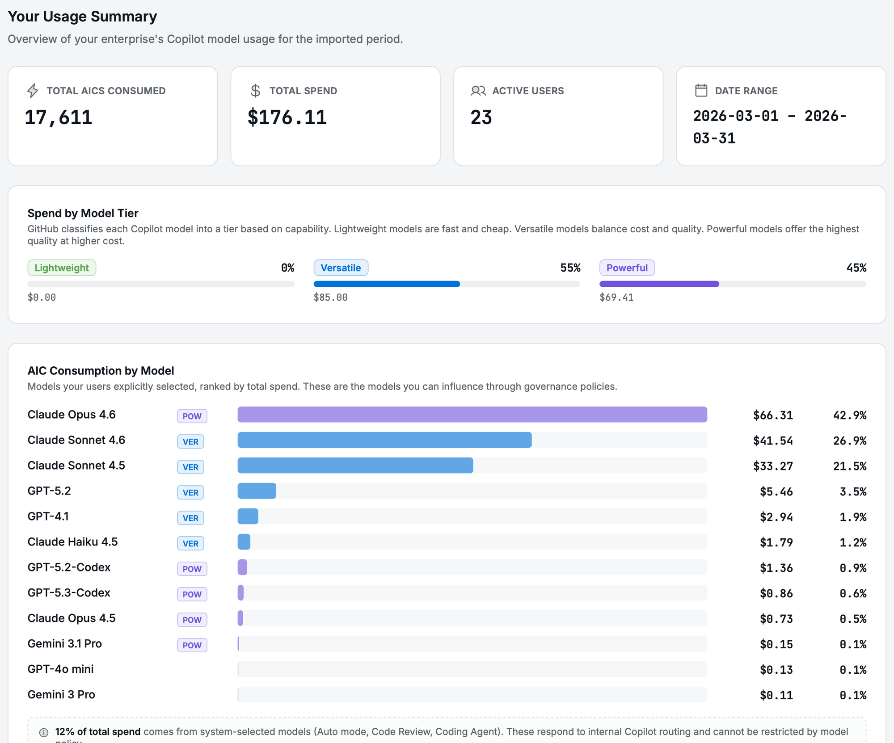
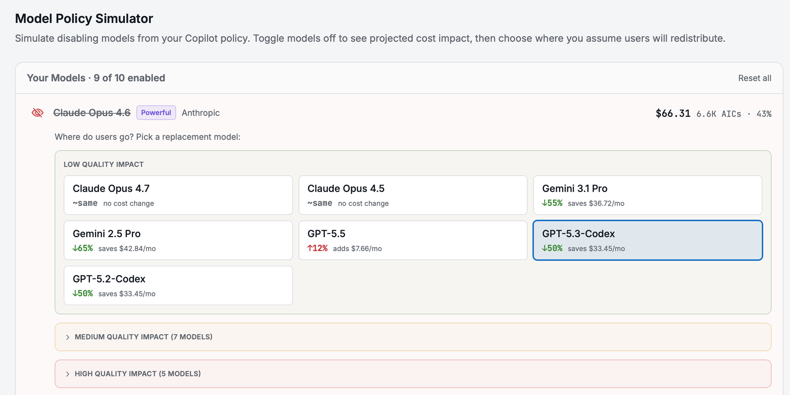
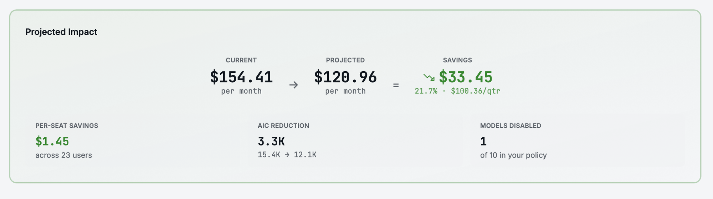

<div align="center">

# 🔬 Copilot Model Policy Simulator

**Evaluate the cost impact of AI model governance decisions before applying them**

[](https://react.dev)
[](https://typescriptlang.org)
[](https://vite.dev)

[](https://xrvk.github.io/copilot-model-policy-simulator/)

---

_A browser-based simulator for GitHub Copilot enterprise admins._
_Upload usage data, simulate disabling models, project savings._

**[Try the live version →](https://xrvk.github.io/copilot-model-policy-simulator/)**

</div>

---

> **Client-side only.** No data leaves your browser. No server, no credentials, no tracking.

---

## ✨ Features

| 📊 Analyze | 🧪 Simulate | 📈 Project |
|-----------|------------|-----------|
| Spend breakdown by model and tier | Toggle models on/off in your policy | Monthly and quarterly savings |
| User count and date range detection | Choose where users redistribute | Per-seat cost impact |
| System-selected vs. user-chosen split | Quality impact grouping (Low/Med/High) | AIC reduction estimates |

---

## 🚀 Quick Start

```bash
npm install
npm run dev
```

Open **http://localhost:5010** 🎉

Or try the live version: **https://xrvk.github.io/copilot-model-policy-simulator/**

---

## 📸 Screenshots

### Usage Summary


### Policy Simulator


### Projected Impact


---

## 📖 How it works

1. **Import** your Premium Request Usage Report CSV from your GitHub enterprise billing page
2. **Visualize** current spend by model, category (Lightweight / Versatile / Powerful), and user count
3. **Simulate** disabling models from your Copilot policy and choosing where users would redirect
4. **Project** monthly and quarterly savings, per-seat impact, and quality tradeoff warnings

---

## ⚠️ Important caveats

- **Directional estimates only.** Different models tokenize the same prompt differently. Cost comparisons are approximate and meant to inform governance discussions, not serve as precise forecasts.
- **System-selected models** (Auto mode, Code Review, Coding Agent) are identified and excluded from simulation since admins cannot restrict them.
- Restricting model choices to save costs may reduce developer productivity with GitHub Copilot.

---

## 🛠️ Development

```bash
npm run dev        # dev server on :5010
npm run lint       # eslint
npm test           # vitest (14 tests)
npm run build      # production build
```

---

## 🔗 Related

- **[GitHub Copilot Docs](https://docs.github.com/en/copilot)** — Official GitHub Copilot documentation

